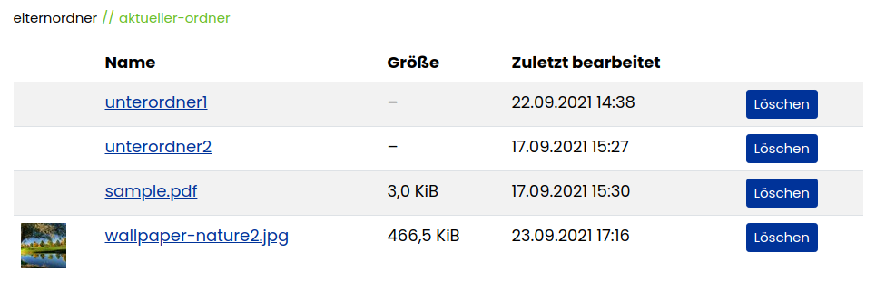

# Contao File Manager Bundle

This bundle offers a frontend file manager for the Contao CMS.

## Features

- display a simple and clean file manager in the frontend
- built with security in mind:
  - takes care of the "public" state of folders
  - always checks if the website user is allowed to see the current folder
  - select allowed folders in a global file manager configuration or based on a member login in member groups separately

## Impressions

The file manager in the frontend

## Installation

1. Install via composer: `composer require heimrichhannot/contao-file-manager-bundle`.

## Usage

1. 

## Events

Event               | Description
--------------------|------------

## TODO

- batch processing
- actions: copy, move, rename, upload
